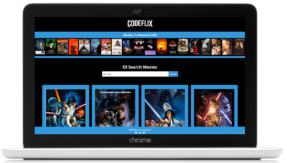

  

# **Codeflix Movies Search**

Exercise inspired on the [**Aprender React JS**](https://github.com/AprendiendoFrontend/Aprendiendo-React/tree/master/search-movies) course final exercise.

This is a responsive movies search web app developed with [](https://html.spec.whatwg.org/) [](https://www.w3.org/Style/CSS/) [](https://sass-lang.com/) [](https://www.ecma-international.org/ecma-262/) and [](https://es.reactjs.org/).

## **Quick start guide**

Instructions to start this project:

### **Pre-requirements**

This project runs with [](https://es.reactjs.org/). Start guide [**here**](https://github.com/facebook/create-react-app).

### **Installation**

Once React has been installed:

1. Clone repository
2. Open a terminal
3. Run `npm install` on the terminal to install local dependencies

### **Run project**

Run `npm start` on the terminal:

1. Open the project on the browser using a local server.
2. Refresh browser everytime files contained in `/src` folder are updated.
3. Compiled files contained in `/src` folder and copy them in `/public` folder in order to be prepared for production environment.

### **Updating**

1. Run these commands to update changes on the project:

```
git add -A
git commit -m "Message commit"
git push
```

2. Run `npm run build` to create `/docs` folder and the production environment version.

3. Run again commands on step 1 to update changes on the project.

4. Project **[URL](https://anaguerraabaroa.github.io/react-codeflix-movies-search/#/)** is also available on GitHub Pages.

## **Project features**

- React app
- Get movies from **[OMDb API](https://www.omdbapi.com)**
- Components structure
- Render a movie list with movie poster, movie title and release year
- Form with filter by movie name
- Detailed movie card window using React Router with movie poster, release year, actors, plot and metascore
- Prevent event default of form
- Render error messages when searched movie doesn't exist or when the URL of detailed movie card doesn't exist
- Save search when user enter on detailed movie card and go back to form
- Save data on LocalStorage
- Responsive app design for mobile, tablet and desktop devices

## **Folder Structure**

```
Codeflix Movies Search
├── docs
├── node_modules
├── public
├── src
│   ├── components
│   │   ├── App.js
│   │   ├── Footer.js
│   │   ├── Header.js
│   │   ├── Hero.js
│   │   ├── Movie.js
│   │   ├── MovieDetails.js
│   │   ├── MovieList.js
│   │   └── SearchForm.js
│   ├── images
│   │    ├── codeflix_movies_desktop.png
│   │    ├── codeflix_movies_mobile.png
│   │    ├── codeflix_movies_tablet.png
│   │    ├── default_image.jpg
│   │    └── hero.png
│   ├── services
│   │    ├── api-details.js
│   │    ├── api.js
│   │    └── localStorage.js
│   ├── stylesheets
│   │   ├── components
│   │   │   ├── _hero.scss
│   │   │   ├── _movie.scss
│   │   │   └── _search-form.scss
│   │   ├── core
│   │   │   ├── _reset.scss
│   │   │   └── _variables.scss
│   │   ├── layout
│   │   │   ├── _footer.scss
│   │   │   ├── _header.scss
│   │   │   ├── _movie-details.scss
│   │   │   └── _movie-list.scss
│   │   └── App.scss
│   └── index.js
├── .gitignore
├── LICENSE
├── package-lock.json
├── package.json
└── README.md
```

## **License**

This project is licensed under [**MIT License**](https://spdx.org/licenses/MIT.html).
